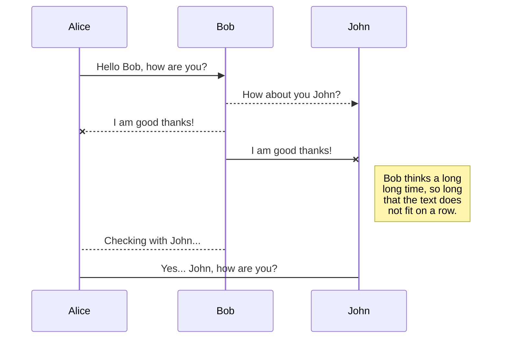

> Written with [StackEdit](https://stackedit.io/).
> # Dutch Decay - The Political Ecosystem
> ## The Objectives
> * Create a universal modelling tool to simulate The Political Ecosystem
> * Let people put in data and simulate the outcomes
> * Input data, models and its mechanics, and output is transparent
> * The output is distributable as a spreadsheet or in image format
> 

